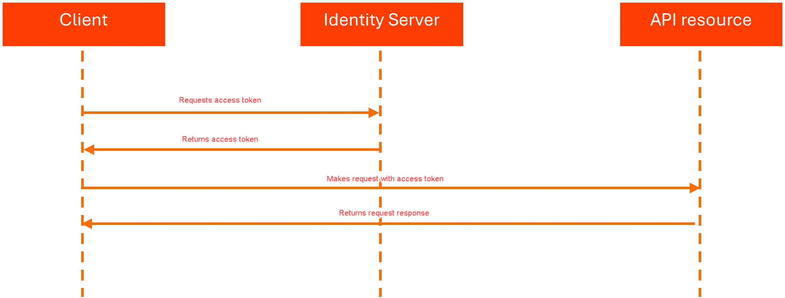

https://docs.uipath.com/automation-cloud/automation-cloud/latest/api-guide/accessing-uipath-resources-using-external-applications

* goal
  * | UiPath products -- being integrated with -- external applications,
    * 👀take in account 👀 
      * managing 
        * scope changes,
        * access tokens
      * refresh tokens

* [OAuth](https://oauth.net/code/)
  * provide libraries /
    * simplify
      * authentication,
      * authorization,
      * delegation
    * secure API calls

# Prerequisites

* | UiPath,
  * organization admin -- has registered -- your external application
  * registration details / external app -- can be authenticated with -- UiPath resources
    * App Type + App ID
      * if you are working with a confidential application -> you need App Secret
      * uses
        * your app -- can authenticate with -- UiPath's Identity Server
    * external app scopes
      * == resources / your external app -- can access -- | UiPath
        * == resource specification (like Assets, Processes, etc.) + permission level (read, write, edit, etc.)

* UiPath's Identity Server
  * == authorization server / 
    * -- enable access -- UiPath resources
    * supports OAuth 2.0 framework

# Authenticating and authorizing external apps

* | AFTER passing the prerequisites,
  * 👀if you provide external app's scope + registered app's credentials (App ID & if it's confidential applications, + App Secret) | Identity Server -> returns an authorization code
  * authorization code -- enable generate the -- access token

* grant type -- based on -- App Type & Scope
  * see [table](https://docs.uipath.com/automation-cloud/automation-cloud/latest/api-guide/accessing-uipath-resources-using-external-applications#which-authorization-grant-type-to-use)
  * if scope name | user == scope name | application scope -> used grant type -- determine the -- caller or the resource
    * _Example:_ Orchestrator

* Declaring scopes
  * TODO:
  * organization-scoped permissions
    * | admin level
      * TODO: 
    * | developer level 
      * use `OR.Machines.View` | "*/identity_/connect/token"
  * fine-grained permissions
    * | admin level
      * TODO:
    * | developer level
      * requirements
        * use `OR.Default` | "*/identity_/connect/token"
          * == wildcard scope / -- depends on -- its assigned role | SPECIFIC tenants or folders
  * TODO:

* Confidential apps + user scopes
  * == authorization code flow
  * TODO:

* Non-Confidential apps + user scopes
  * == authorization code + PKCE flow
  * TODO:

* Confidential apps + app scopes
  * == client credentials flow
  
    * see [RFC 6749](https://datatracker.ietf.org/doc/html/rfc6749#section-4.4)
    * steps
      * POST https://cloud.uipath.com/{organizationName}/identity_/connect/token?grant_type=client_credentials&client_id={{app_id}}&client_secret={{app_secret}}&scope={{scopes}}
        * `client_id`
          * == unique identifier /
            * -- assigned to the -- application | register the app
            * -- MUST contain the -- App ID
        * `client_secret`
          * -- MUST contain the -- App Secret
        * `scope`
          * == `scope1 scope2 scope3 ...`
            * _Example:_ `OR.Machines.View OR.Default`

# Using the access token

* access token
  * enable
    * -- getting access to the -- allowed resources /
      * limited to the selected scopes,
      * till token expires (by default, 1 hour)

* _Example:_ request | odata/Machines API -- via -- access token | Authorization header
  * access token's scope claim -- contains -- OR.Machines  

    ```
    curl -X GET "https://cloud.uipath.com/{organizationName}/{tenantName}/orchestrator_/odata/Machines"
      -H "Authorization: Bearer {access_token}" -H  "accept: application/json"
    ```

# Obtaining a refresh token

* Access tokens
  * lifetime == 1 hour
  * refresh token
    * == get NEW access token / ⚠️NO user interaction ⚠️
    * 👀AVAILABLE | external applications 👀
      * confidential &
      * non-confidential
    * ❌NOT AVAILABLE | UI ❌
      * -> clients -- need, via their credentials, to -- reauthenticate
    * ALLOWED 1! use
    * lifetime = 60 days 
    * 👀if you want to get
      * NEW access token + refresh token -> "https://cloud.uipath.com/{organizationName}/identity_/connect/token" /requestBody's `scope` -- MUST include -- `offline_access` 👀
      * NEW access token (that's right ?) + NEW refresh token -> "https://cloud.uipath.com/{organizationName}/identity_/connect/token" /requestBody's `"grant_type": "refresh_token"` 👀
  * if the external application is non-confidential & `"grant_type": "PKCE"` -> remove the request body's `client_secret` 

# UiPath® Identity Server endpoints

* ⚠️if you trigger requests from Postman or similar -> add `"content-type":"application/x-www-form-urlencoded"`⚠️
* endpoints / Identity Server layer -- see website --
  * Discovery
  * Authorization
    * uses
      * | browser
  * Token
    * uses
      * programatically