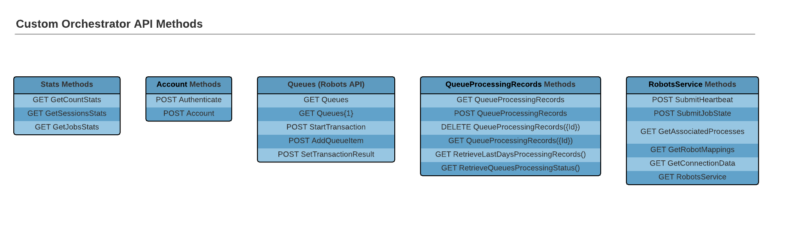
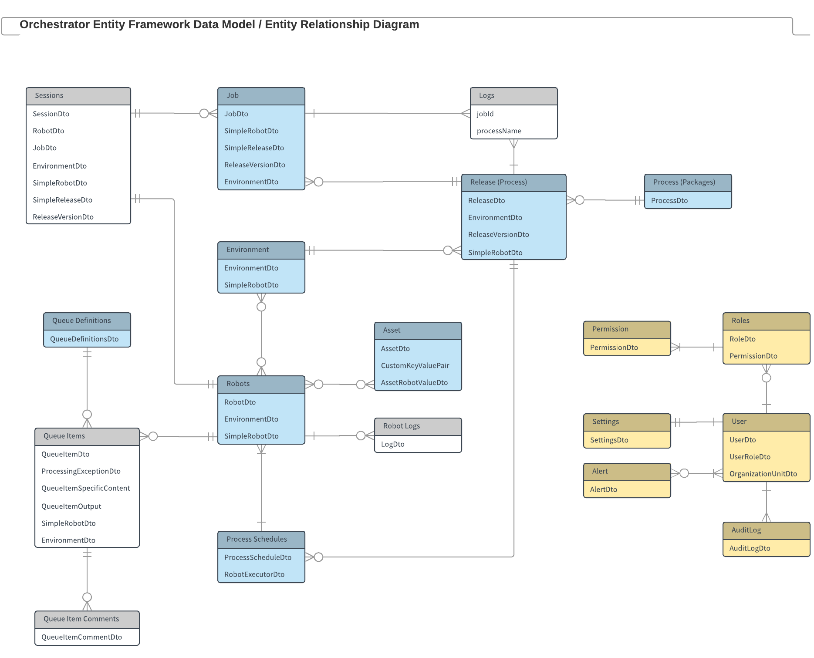

https://docs.uipath.com/orchestrator/automation-cloud/latest/api-guide/about-odata-and-references

* 👀Orchestrator API implementation -- is based on the -- OData protocol 👀
  * https://cloud.uipath.com/{organizationName}/{tenantName}/orchestrator_/odata
    * metadata URL 
  * format
    * by default, JSON
    * if you want to use XML -> append `/?$format=xml` | URL
  * allows
    * querying stats -- ABOUT -- entities (Robot, Process, Queue, ...) / registered | Orchestrator
  * AVAILABLE operations
    * CRUD
      * ❌NOT ALL | EACH logical resource ❌
    * Requesting Data
      * == request PARTICULAR resource's information
      * via
        * GET operations
        * [OData-specific parameters](https://docs.oasis-open.org/odata/odata/v4.0/errata03/os/complete/part1-protocol/odata-v4.0-errata03-os-part1-protocol-complete.html#_Toc453752283)
          * _Example:_ query, filter, sort, select, ... 
    * Custom Actions
      * ❌NOT tied -- to a -- logical resource ❌
      * Stats methods
        * -- provide -- aggregates information | DIFFERENT entities
      * Account methods
        * -- provide -- authentication Orchestrator's methods
      * Queues methods
        * used by 
          * the Robot -- to access -- queues
      * QueueProcessingRecords methods
        * -- provide -- statistical and aggregate information -- about -- queues
        * restrictions
          * < 3 months
      * RobotsService resources
        * used by 
          * Orchestrator -- to communicate with the -- Robot
      
          

* Orchestrator Entity Data Model
  * EACH logical resource == OData entity
  * EACH entity has
    * properties,
    * relationships,
    * operations
    

* OData (Open Data Protocol)
  * == ISO/IEC approved OASIS standard / 
    * defines -- for -- building & consuming RESTful APIs
      * set of best practices
      * core semantics
      * behavioral aspects
  * enables the
    * creation of REST-based data services /
      * allow resources
      * -- identified via -- URLs
      * defined | data model,
      * can be published and edited -- via HTTP messages, by -- Web clients
  * [official documentation](https://docs.oasis-open.org/odata/odata/v4.0/errata03/os/complete/part1-protocol/odata-v4.0-errata03-os-part1-protocol-complete.html)